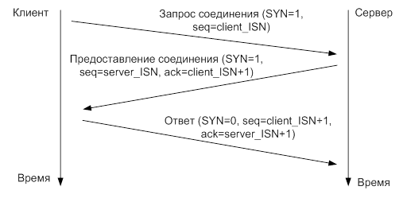

В примере некоторое количество TCP Flow (общение, характеризуемое парами IP+port - IP+port).

Необходимо с использованием DPDK прочесть файл и разделить его на 2 файла:
* которые необходимо дропнуть,
* и которые необходимо отправить дальше.

Записать результаты фильтрации в 2 разных файла для будущей проверки

Фильтрация простая - запоминаем flow, пакеты, для которых не видели этап установления соединения
(3-way handshake) отбрасываются.
Остальные пакеты отправляются дальше.

Замечание: Что такое этап установление соединения:



На данный момент, все пакеты отправляются дальше.

Необходимо реализовать функцию, которая бы вызывалась из main.c:132
```
//
// Todo тут что-то сделать
//
```
в которой происходила бы классификация пакетов на отправляемые дальше и отбрасываемые.

Необходимо пройти pcap файл только один раз, но не больше.
Разработать алгоритм, позволяющий классифицировать пакеты с большой пропускной способностью и с разумным
потреблением памяти.

В репозитории присутствуют 3 файла:
* `test_tcp.pcap` - исходный файл с "грязным" трафиком
* `tcp_accepted.pcap` - очищенный трафик
* `tcp_dropped.pcap` - грязный трафик

Проект описан в формате CMake. Присутствует цель - run, для запуска теста с правильно оформленными аргументами

Для запуска требуются:
* libpcap-dev
* cmake
* make (для DPDK)

В случае чего, аргументы вызова:
```
--vdev 'net_pcap0,rx_pcap=test_tcp.pcap,tx_pcap=test_tcp_out.pcap' --no-huge
```